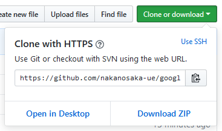
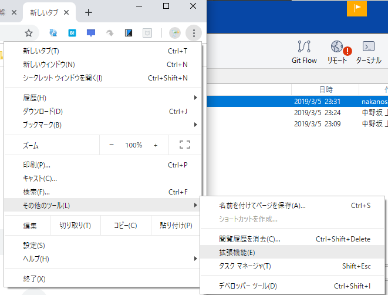
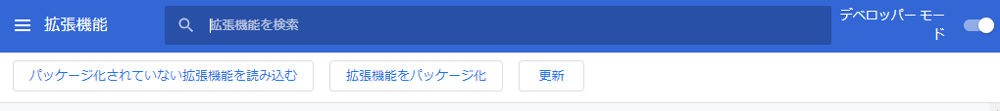
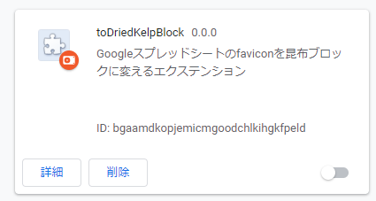

# 概要
Googleスプレッドシートのfaviconを、Minecraftのこんぶブロックに変換するChrome拡張です。

# 使い方
**導入は自己責任でお願いします！**

https://github.com/nakanosaka-ue/google_sheets_to_dried_kelp_block

ダウンロードしたzipファイルは解凍してください

解凍したフォルダを指定するのです

